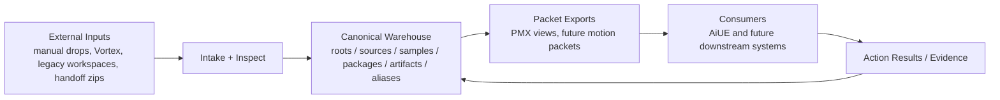

# toy-yard

**canonical warehouse + packet exchange hub**

`toy-yard` is a CLI-first warehouse for messy, real-world 3D asset work:

- intake from multiple external roots
- canonical IDs, lineage, aliases, and evidence
- packet export for downstream consumers
- explicit separation between warehouse truth and consumer-specific views

It is designed for a world where assets do not come from one clean source.
They arrive from old workspaces, marketplaces, mod managers, AI pipelines, and handoff packs.
`toy-yard` turns that sprawl into a managed system.

## Why It Exists

The long-term goal is not just “store files somewhere.”

The goal is to make one place responsible for:

- provenance
- classification
- compatibility notes
- failure lineage
- packet export
- cross-repo coordination

That makes `toy-yard` the canonical system of record, while downstream tools such as `AiUE` consume exported views instead of raw warehouse internals.

## Current Shape

Today `toy-yard` already supports:

- source-agnostic package intake
- v1 intake / triage for `manual_drop` and `Vortex/skyrimse`
- canonical warehouse entities:
  - `roots`
  - `sources`
  - `samples`
  - `packages`
  - `artifacts`
  - `aliases`
- legacy `3dgirls` import as a read-only external root
- AiUE-facing PMX export views
- AiUE roundtrip result import
- machine-readable communication signals for PMX and motion lanes
- motion handoff catalog admission as a shadow lane

## Architecture



## Repository Layout

This repository intentionally tracks the **code and fixtures**, not the live warehouse contents.

```text
src/toyyard/      Python package
tests/            unit and end-to-end tests
_fixtures/        stable test fixtures
_rules/           TOML classification rules
toyyard.py        local CLI launcher
```

Live warehouse zones such as `00_inbox/`, `01_intake/`, `03_workbench/`, `04_registry/`, and `05_publish/` are local runtime state and are ignored in git.

## Quick Start

### 1. Install

```powershell
cd C:\Projects\toy-yard
pip install -e .
```

### 2. Initialize a local warehouse root

```powershell
toyyard init
```

If you prefer the wrapper without editable install:

```powershell
python toyyard.py init
```

### 3. Ingest and inspect

```powershell
toyyard ingest import C:\path\to\package.zip --source manual_drop --game unknown
toyyard ingest scan --source vortex --game skyrimse
toyyard triage run 1
toyyard inspect package 1
toyyard report blocked
```

### 4. Canonical import / export flows

```powershell
toyyard root add --kind legacy_workspace --path C:\Users\garro\Downloads\3dgirls --name 3dgirls
toyyard import legacy-3dgirls --root-id 2
toyyard export aiue-pmx-view --profile default --sample <canonical_sample_id_or_alias>
toyyard report communication-signal --lane pmx --profile default
toyyard import aiue-results --export-root <profile_root> --trial-root <trial_root>
```

### 5. Motion shadow lane

```powershell
toyyard import motion-handoff --package-id 2
toyyard report motion-catalog
toyyard report communication-signal --lane motion
toyyard inspect source <source_id>
```

## Status

### PMX Lane

- `T1.6 Durable Roundtrip Confirmation`: passed
- `T2A Default-Source Confirmation`: passed
- `toy-yard export` is now viable as the default PMX source for new AiUE runs
- `communication signal v0`: passed and emitting machine-readable handoff state

### Motion Lane

- current stage: `Catalog v0`
- admitted as a shadow lane, not yet default downstream consumption
- first real seed sample: `ai-motion-motion-pack-handoff-2026-04-13.zip`
- `communication signal v0`: available for motion catalog state

## Roadmap

### v1

Build `toy-yard` into a stable warehouse and packet hub:

1. complete the motion lane:
   - motion contract
   - motion packet export
   - motion self-check
   - first shadow consumer
2. run `M0.5 Motion Shadow Packet Trial`

### v2

Grow from one pipeline into a broader exchange hub:

1. admit more external asset sources
2. admit more motion sources
3. support multiple downstream consumers
4. stabilize `toy-yard` as the handoff layer between warehouse truth and consumer-specific packets

## Design Principles

- **canonical first**: warehouse IDs and lineage belong to `toy-yard`
- **file-based consumer boundaries**: downstream tools consume packets, not the warehouse DB
- **evidence matters**: reports, validation payloads, and failures are first-class
- **migration over rewrite fantasies**: legacy roots are imported in-place before any aggressive cutover
- **real samples drive the model**: contracts should be shaped by actual packages, not imagined perfect inputs

## Testing

```powershell
python -m unittest discover -s tests -v
```

The test suite covers:

- intake and triage
- legacy `3dgirls` import
- AiUE PMX export and roundtrip durability
- motion handoff cataloging

## Short Version

`toy-yard` is where raw asset chaos becomes canonical, traceable, and exchangeable.
